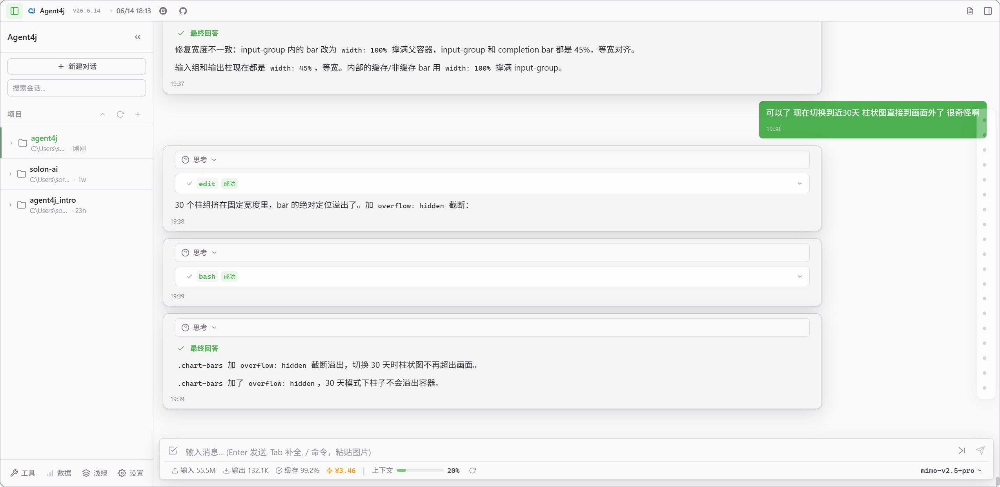
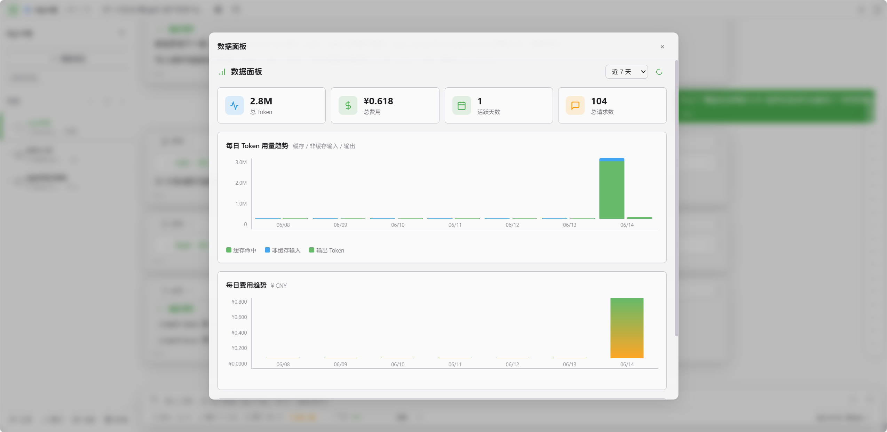
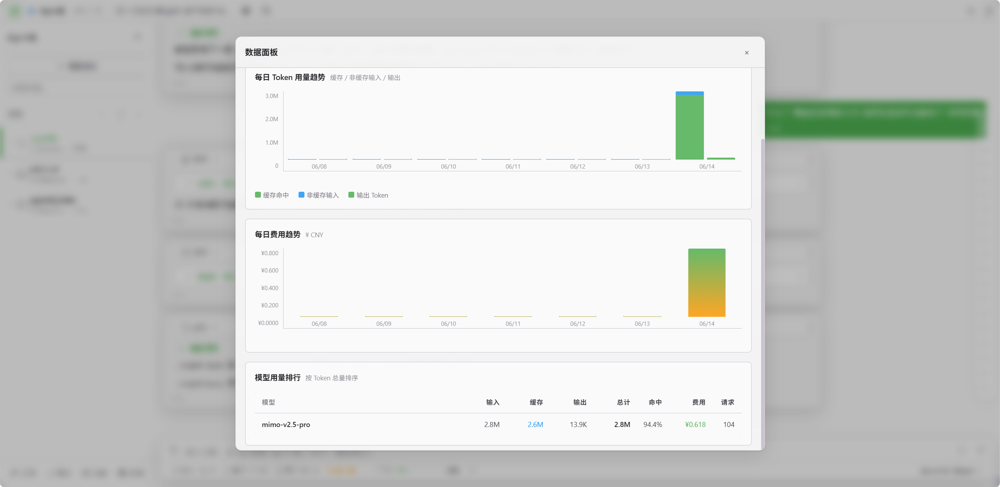
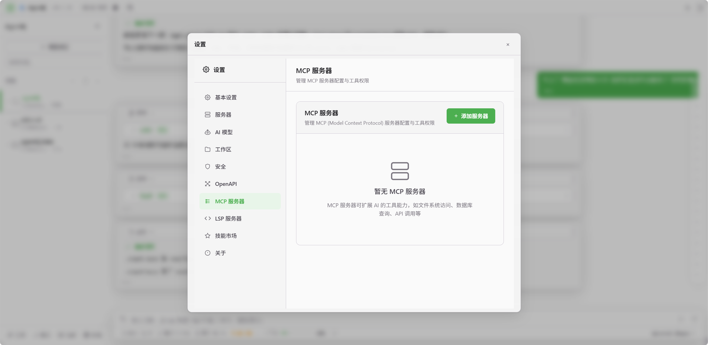
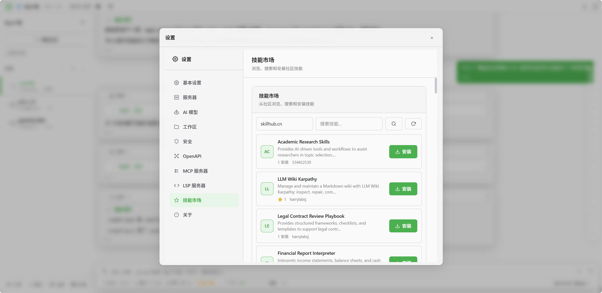
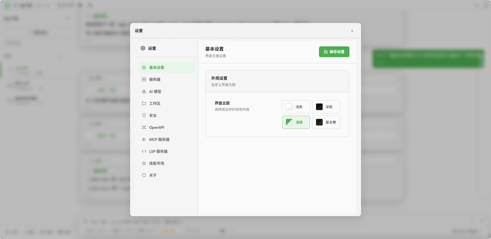
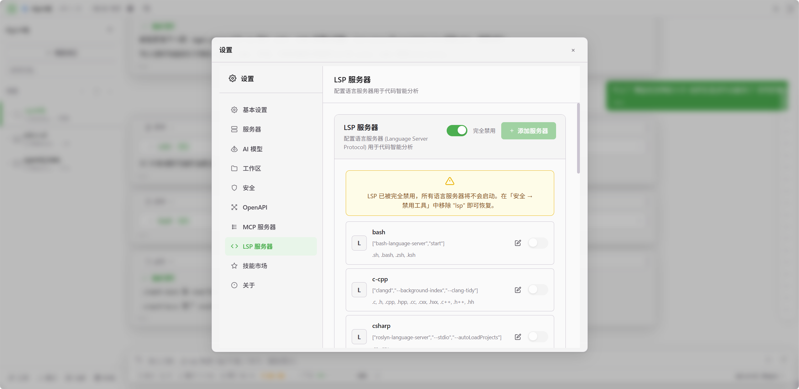

# Loopra — 纯 Java 的 AI 编码代理

<p align="center">
  
</p>

<p align="center">
  <strong>类似 Claude Code / Codex / OpenCode / Reasonix，但纯 Java 实现</strong><br>
  推理循环 · 工具调用 · 流式输出 · 会话管理 · 子代理隔离<br>
  CLI / Web / Desktop 三端覆盖，让 AI 自主读写代码、跑命令、调 API。
</p>

<p align="center">
  
  
  
  
  
  
  <a href="CHANGELOG.md"></a>
</p>

---

## 📖 这是什么？

**Loopra** 是一个纯 Java 17 的 AI 编码代理。和 Claude Code、Codex、OpenCode、Reasonix 一样——你给它一个任务，它能自己读代码、写代码、跑命令、调 API，一步步把事情干完。

核心是一个 **推理循环（Reasoning Loop）**：

```
用户说 → LLM 想 → 调工具 → 看结果 → LLM 再想 → 再调工具 → …… → 干完
```

| 对标产品            | 实现语言          |
|-----------------|---------------|
| **Claude Code** | TypeScript    |
| **Codex**       | TypeScript    |
| **OpenCode**    | Go            |
| **Reasonix**    | Rust          |
| **Loopra**     | **Java 17** ✅ |

如果你在用 Java 技术栈，又想有一个 AI 编码代理来帮忙写代码、改代码、跑构建、查日志——Loopra 是你的选择。

---

## 🚀 快速开始

### 一键安装

**Windows**（PowerShell）：

```powershell
irm https://raw.giteeusercontent.com/ezdemo/loopra/raw/main/.release/setup.ps1 | iex
```

**macOS / Linux**：

```bash
curl -fsSL https://raw.giteeusercontent.com/ezdemo/loopra/raw/main/.release/setup.sh | bash
```

### 直接运行

```bash
# 启动 Web 服务（随机端口，首次自动生成配置）
loopra web 0
```

首次启动会自动创建 `~/.loopra/config.json`，填入 API Key 和模型后重启：

```json
{
  "baseUrl": "https://api.deepseek.com/v1",
  "apiKey": "sk-your-api-key",
  "model": "deepseek-v4-flash",
  "workspaceDir": "/path/to/your/project"
}
```

---

## 📸 界面预览

### 主界面

<p align="center">
  
</p>

### 数据面板

<p align="center">
  
  &nbsp;&nbsp;
  
</p>

---

## ✨ 功能

### 🤖 推理循环

| 能力         | 说明                                    |
|------------|---------------------------------------|
| **自动循环**   | Prompt → LLM → 工具 → 结果 → LLM，自动迭代直到完成 |
| **流式输出**   | 实时推送思考过程、工具调用和结果                      |
| **上下文折叠**  | 旧消息自动摘要，不机械截断                         |
| **消息自愈**   | 自动修复被截断的 JSON 和 tool_calls            |
| **风暴断路器**  | 检测重复工具调用，防止死循环                        |
| **推理模型支持** | 原生支持展示思考过程                            |

### 🛠️ 工具系统

- **声明式工具**：基于 Solon `@ToolMapping` 定义名称、参数和执行逻辑
- **自动注册**：Solon `@Component` 自动发现
- **工具管理**：可视化启用/禁用工具，并自定义只读/写入执行权限分类
- **MCP 支持**：接入 Model Context Protocol 协议

<p align="center">
  
</p>

- **OpenAPI 集成**：任意 OpenAPI 规范自动转成工具
- **技能市场**：在线装/卸社区技能
- **AI 浏览器**：在桌面端浏览器中打开标签页、读取结构化页面快照并执行受控交互；登录与验证由用户接管

<p align="center">
  
</p>

- **计划模式**：`/plan` 限制为只读操作，`/execute` 恢复全部工具

### 🔄 子代理

- **隔离执行**：每个子代理有独立上下文和推理循环
- **继承工具**：复制父代理的工具集，排除递归 spawn
- **内嵌展示**：子代理执行过程在聊天流中直接展开
- **用量统计**：按模型统计 token 消耗
- **预设角色**：`explore`、`implement`、`test`、`review`、`plan`；探索、审查和方案角色只能使用只读工具
- **风暴断路器**：检测重复调用，自动取消超时子代理

### 🧠 项目记忆与共享工作区

- **项目级长期记忆**：`memory` 工具将架构决策、约定和踩坑经验持久化在 `.loopra/loopra-memory.md`，供后续会话按需检索
- **共享工作区**：`workspace_read` / `workspace_write` / `workspace_list` 按项目持久化到 `.loopra/workspace/`，用于父子代理间的结构化协作

### 🎯 Goal

- **会话级目标**：`/goal create <目标>` 创建可恢复的复杂任务目标
- **可验证进度**：步骤更新必须记录执行证据，全部步骤完成后才能关闭 Goal
- **结束保护**：存在未关闭 Goal 时，Agent 不会直接 `finish`；阻塞时明确记录原因，恢复后继续

### 👤 人工审批（HITL）

- 三态审批模式：`free`（自由）/ `approval`（审批）/ `auto`（按白名单自动放行）
- 执行写操作前等你批准或拒绝
- 可配置独立校验模型，在审批前评估危险工具调用；工作区越界始终要求人工确认
- 白名单工具（`finish` / `ask_choice` 等）自动放行
- `/agree` / `/deny` 快速决策
- 子代理中的写操作同样触发审批

### 💬 会话

- 多会话创建、切换、搜索、删除
- JSONL 格式持久化，工作区隔离
- 自动生成会话标题，记录每次 token 用量
- 会话分支功能：从任意消息节点分支新对话
- 消息快照系统：基于 Git 的检查点，支持无快照的消息撤回

### 🌐 三种界面

| 形态          | 怎么用          |
|-------------|--------------|
| **CLI**     | 终端里直接干       |
| **Web**     | 浏览器打开可视化界面   |
| **Desktop** | Electron 原生桌面应用 |

### 🎨 前端

- 深色、浅色、复古绿、复古黄四套主题
- SSE 流式打字机效果，工具调用可视化
- Git 面板、工作区管理、代码语法高亮（Shiki/Shikiji）
- 毛玻璃视觉效果、消息时间戳与流式加载动画

---

## 🆕 近期亮点

> 📋 完整更新历史请查看 [CHANGELOG.md](CHANGELOG.md)

- **模型渠道与 Responses API**：渠道级配置 API、协议和模型能力，兼容 OpenAI Responses API
- **AI 校验模型**：为高风险工具调用增加可配置的自动安全校验，工作区越界仍由用户确认
- **项目记忆与共享工作区**：跨会话沉淀项目事实，父子代理按项目协作并持久化结构化结果
- **AI 浏览器**：桌面端可见浏览器支持安全的页面快照、标签页管理和用户接管验证
- **子代理管理**：`sub_agent` 预设五种角色，支持独立管理页、缓存亲和和超时取消
- **聊天性能**：消息虚拟滚动、文件路径预览和差异块导航提升长会话浏览效率
- **工具管理**：可视化启用/禁用任意工具，并定义自定义工具的只读/写入分类
- **桌面体验**：多聊天标签、元素检查、服务进程管理和改进的模型选择器

---

## ⚡ 前缀缓存

Loopra 充分利用 DeepSeek 和 Mimo 的**前缀缓存（Prefix Caching）**能力——系统提示词、工具定义、项目文档等每次都在 prompt 开头的重复内容，直接命中 KV cache：

| 模型                                                | 缓存命中率     | 效果               |
|---------------------------------------------------|-----------|------------------|
| **DeepSeek**（deepseek-v4-flash / deepseek-v4-pro） | **≥ 97%** | 输入 token 费用降至 3% |
| **小米 Mimo**（mimo-v2.5 / mimo-v2.5-pro）            | **≥ 98%** | 输入 token 费用降至 2% |

实际编码会话中，消息列表头部的大量系统指令和工具描述每次都一样，前缀缓存命中后这部分 token 几乎免费。

---

## 🏗️ 项目结构

```
loopra/
├── loopra-bin/               # 核心引擎（含工具抽象层）
│   ├── agent/                 # 推理循环
│   │   ├── AgentLoop.java      # 推理循环
│   │   ├── LoopraAgent.java   # Agent 工厂
│   │   ├── SubAgent.java       # 子代理
│   │   ├── context/            # 对话上下文 / 上下文折叠
│   │   ├── model/              # LLM 客户端
│   │   └── hitl/               # 人工审批
│   ├── tool/                  # 工具系统（原 loopra-tool 已合并）
│   │   ├── AgentTool.java      # 工具基类
│   │   ├── ToolContext.java     # 执行上下文
│   │   ├── builtin/            # 内置工具
│   │   ├── executor/           # Shell / 交互式命令执行
│   │   ├── solon/              # Solon 集成（技能/MCP/OpenAPI/插件）
│   │   └── vision/             # 视觉识别工具
│   ├── session/               # 会话持久化
│   ├── workspace/             # 共享工作区
│   ├── workflow/              # 工作流引擎
│   ├── command/               # 聊天命令
│   └── config/                # ~/.loopra/config.json
│
├── loopra-web/               # Web 后端
│   ├── controller/            # REST 接口
│   ├── service/               # Agent 管理 / SSE 推送
│   └── market/                # 技能市场
│
├── loopra-front/             # Vue 3 前端 + Electron 桌面端
│   ├── src/
│   │   ├── components/
│   │   ├── views/
│   │   ├── services/
│   │   │   ├── api.js
│   │   │   └── platform.js    # 平台适配层（Electron/Web）
│   │   └── stores/app.js
│   ├── electron/
│   │   ├── main.cjs           # Electron 主进程
│   │   └── preload.cjs        # 预加载脚本
│   ├── electron-builder.json  # 打包配置
│   └── vite.config.js
│
├── intro/                     # 官网
├── docs/superpowers/          # 文档
├── pom.xml                    # Maven 父 POM
└── LICENSE                    # MIT
```

---

## ⚙️ 配置

配置文件 `~/.loopra/config.json`：

<p align="center">
  
  &nbsp;&nbsp;
  
</p>

| 字段                | 类型       | 默认值                         | 说明                               |
|-------------------|----------|-----------------------------|----------------------------------|
| `modelChannels`   | array    | 默认渠道                        | 渠道级 API 地址、密钥、协议和模型能力配置           |
| `modelChannelId`  | string   | `default`                   | 当前模型所属的渠道 ID                      |
| `model`           | string   | `deepseek-v4-flash`         | 当前模型名                              |
| `validationModel` | string   | `""`                        | 可选的危险工具调用校验模型                      |
| `validationModelChannelId` | string | `""`                   | 校验模型所属渠道 ID                         |
| `workspaceDir`    | string   | `""`                        | 工作区目录                            |
| `reasoningEffort` | string   | `high`                      | 推理强度：`low`/`medium`/`high`/`max` |
| `lang`            | string   | `ZH`                        | 语言                               |
| `hitl`            | string   | `free`                      | `free` / `approval` / `auto` 审批模式 |
| `editMode`        | string   | `auto`                      | `auto`（需确认）/ `yolo`（直接干）         |
| `maxContextChars` | int      | `200000`                    | 上下文上限                            |
| `keepTailChars`   | int      | `80000`                     | 保留尾部预算                           |
| `toolTimeoutSec`  | int      | `360`                       | 工具超时                             |
| `subAgentTimeoutSec` | int   | `3600`                      | 子代理完整执行超时                       |
| `terminateOnNoToolCall` | boolean | `true`                   | 无工具调用时结束；`false` 时追加 `FinishTool.TIPS` 强制继续 |
| `disabledTools`   | string[] | `[]`                        | 禁用工具                             |
| `blockedPaths`    | string[] | `[]`                        | 路径拦截                             |

---

## 🎯 命令

| 命令          | 功能       |
|-------------|----------|
| `/help`     | 帮助       |
| `/new`      | 新会话      |
| `/plan`     | 进入计划模式   |
| `/execute`  | 退出计划模式   |
| `/compact`  | 折叠历史     |
| `/retry`    | 撤回重试     |
| `/rewind N` | 回退到第 N 轮 |
| `/sessions` | 列出会话     |
| `/load N`   | 加载会话     |
| `/init`     | 分析项目生成文档 |
| `/goal`     | 管理当前会话目标 |
| `/hitl`     | 切换审批模式   |
| `/agree`    | 批准       |
| `/deny`     | 拒绝       |
| `/continue` | 继续生成     |
| `/exit`     | 退出       |

---

## 🧩 内置工具

| 工具                                                                          | 用途         |
|-----------------------------------------------------------------------------|------------|
| `read` / `write` / `edit`                                                   | 读/写/改文件    |
| `glob` / `grep` / `ls`                                                      | 搜索文件与内容    |
| `bash`                                                                      | 跑命令        |
| `bash_start` / `bash_wait` / `bash_stdin` / `bash_stop`                     | 交互式命令会话    |
| `sub_agent`                                                                 | 派生预设角色子代理 |
| `workspace_read` / `workspace_write` / `workspace_list`                     | 按项目持久化的共享工作区 |
| `memory`                                                                    | 跨会话项目记忆   |
| `goal_create` / `goal_status` / `goal_update_step` / `goal_complete`       | 可恢复的会话目标  |
| `checklist_start` / `checklist_status` / `checklist_step`                  | 有序工作清单    |
| `browser_new_tab` / `browser_tabs` / `browser_navigate` / `browser_screenshot` / `browser_act` / `browser_close_tab` | 桌面 AI 浏览器 |
| `browser_request_user_action`                                               | 请求用户接管登录或验证 |
| `webfetch` / `codesearch` / `java_source`                                   | 网页与代码检索   |
| `call_api` / `vision_recognize`                                             | REST API 与图片识别 |
| `ask_choice` / `finish`                                                     | 用户交互与对话结束 |

---

## 🛠️ 技术栈

| 层       | 技术                                  |
|---------|-------------------------------------|
| **语言**  | Java 17                             |
| **后端**  | Solon 4.0.2 + Snack4 + OkHttp        |
| **前端**  | Vue 3.4 + Vite 5 + Ant Design Vue 4 |
| **桌面**  | Electron + Node.js                    |
| **持久化** | JSON Lines                          |
| **文档**  | Knife4j                             |

---

## 📊 性能

| 指标            | 数据      |
|---------------|---------|
| 最大上下文字符      | 200,000 |
| 会话并发         | 50（LRU） |
| 工具超时         | 360 秒可配 |
| 子代理超时        | 3600 秒  |

> ⚡ 前缀缓存：DeepSeek **≥ 97%** / 小米 Mimo **≥ 98%**，输入成本降至原始的 **2%~3%**。[详情](#-前缀缓存)

---

## 🗺️ 路线图

- [x] 推理循环
- [x] 工具调用
- [x] 流式输出
- [x] 会话管理
- [x] 子代理
- [x] 人工审批
- [x] 前缀缓存（DeepSeek 97%+ / Mimo 98%+）
- [x] MCP 协议
- [x] 技能市场
- [x] Electron 桌面端
- [x] OpenAPI 集成
- [x] Git 面板
- [x] 多模态
- [x] ACP 协议
- [ ] 本地知识库
- [ ] 团队协作

---

## 📄 许可证

MIT License © 2026 Sorghum
